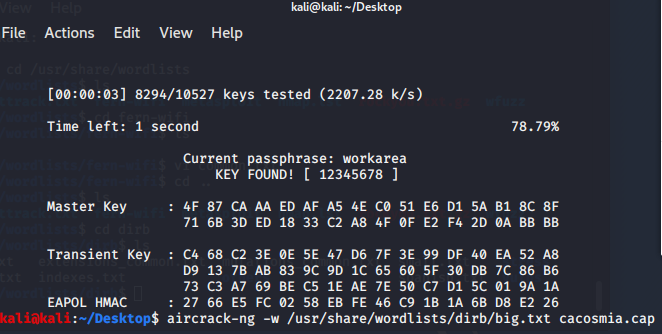
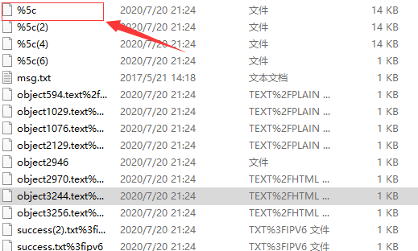
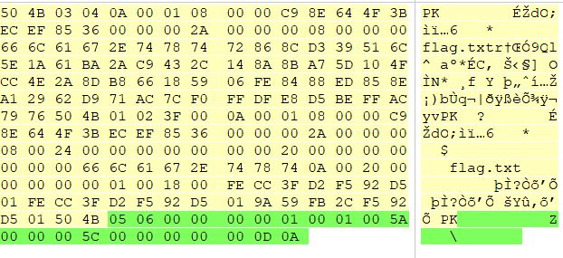
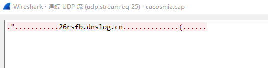

# 恶臭的数据包

* 解压之后，发现是数据包

* 打开后发现是加wpa wifi 文件
``` 
aircrack-ng -w /usr/share/wordlists/dirb/big.txt cacosmia.cap
```



* 将密码添加到wireshark


* 用wireshark 导出对象/http


* winhex 打开%5c 发现有个zip中藏着flag文件，将zip复制出，发现还有密码


* 查看文件存在的数据流，发现有session， 是jwt，将jwt中的Payload获取出，并用base64解密
> https://juejin.im/post/5a437441f265da43294e54c3
``` 
{"hint":"for security, I set my password as a website which i just pinged before"}
```

* ping跟基于ICMP， DNS（基于UDP协议）跟PING有关，查找UDP流

```
26rsfb.dnslog.cn
```

* 解压压缩包，会获得flag
