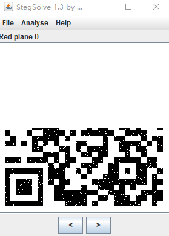
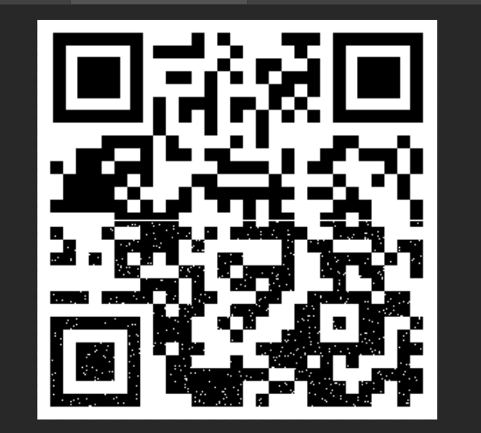
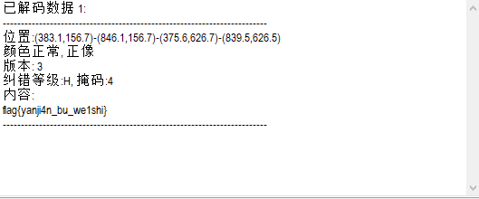

# SimpleRAR

* 修改rar文件中png的文件头
> 文件块的HEAD_TYPE应该是0×74而不是0x7A。

* 解压出security.png文件

* Stegsolve.jar 打开图片文件，找到二维码

* winhexe 查看security.png文件， 发现是gif图片

* 修改图片后缀名，用ps打开，并将另一图层图片复制出

* Stegsolve.jar 查看复制出的文件

* ps合并两张二维码

* CQR.exe 扫描二维码

