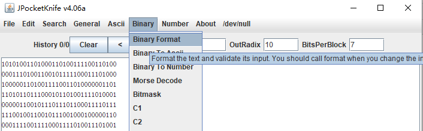
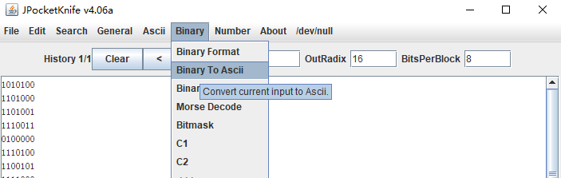
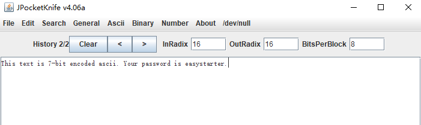

# Training: Encodings I

* 题目
``` 
We intercepted this message from one challenger to another, maybe you can find out what they were talking about.
To help you on your progress I coded a small java application, called JPK.
Note: The message is most likely in english.

10101001101000110100111100110100
00011101001100101111100011101000
10000011010011110011010000001101
11010110111000101101001111010001
00000110010111011101100011110111
11100100110010111001000100000110
00011110011110001111010011101001
01011100100000101100111011111110
10111100100100000111000011000011
11001111100111110111110111111100
10110010001000001101001111001101
00000110010111000011110011111100
11110011111010011000011110010111
0100110010111100100101110
```

* 下载JPK（题目提供的）
*  Binary format将数据化为8个一排


* 使用Binary， Binary to ascii


* 结果
